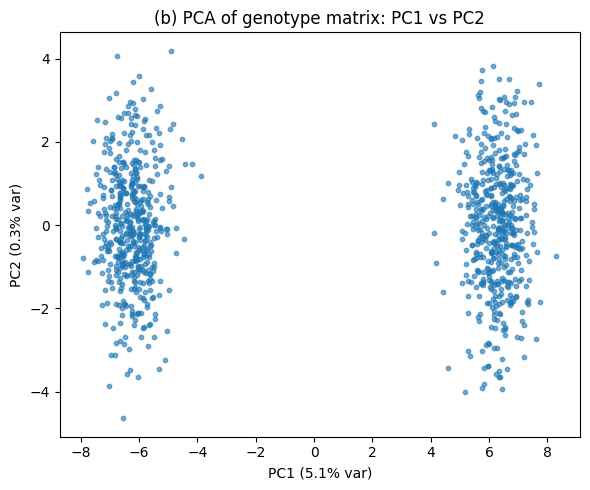
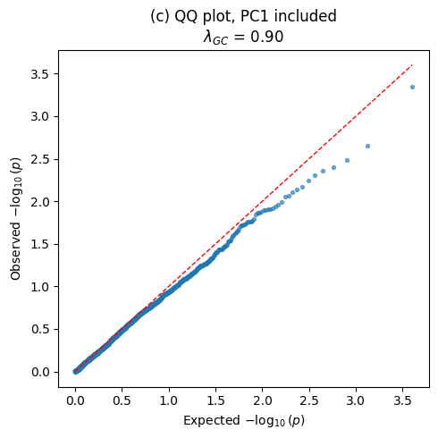
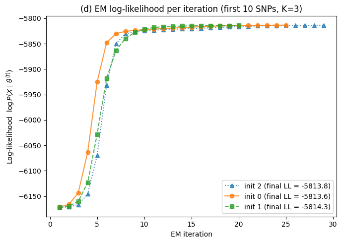
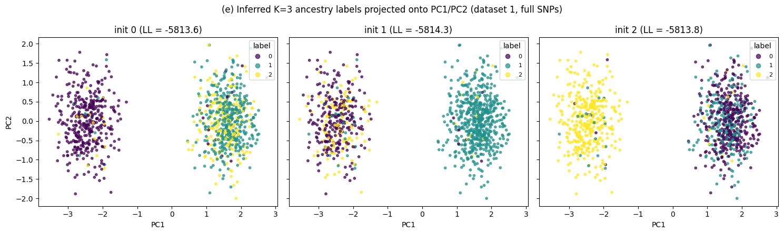

# C124/224 — Problem Set 4

Graphical models and EM implementation.

## Environment

```bash
python3 -m venv .venv
.venv/bin/pip install numpy pandas matplotlib scikit-learn scipy statsmodels jupyter
.venv/bin/jupyter nbconvert --to notebook --execute --inplace q1_template.ipynb q3_template.ipynb
```

(The `.venv/` directory is local tooling only and is not part of the submission.)

## Q1 — GWAS with PCA

| Part | Result |
|------|--------|
| (a) Univariate regression | p-values strongly inflated (λ_GC ≈ 2.66); **14 SNPs** significant (Bonferroni, α=0.05) |
| (b) PCA | PC1 dominates and splits individuals into two clusters → **2 populations** |
| (c) Regression + PC1 | inflation removed (λ_GC ≈ 0.90); **0 SNPs** significant — stratification explained away |

**(b) PCA of the genotype matrix (PC1 vs PC2).** Two clearly separated clusters along PC1.



**(c) QQ plot with PC1 included as a covariate.** Points fall back onto the y=x line — the spurious associations from (a) disappear.



## Q3 — EM ancestry model

Implements the full EM algorithm for a Bernoulli mixture over `K` populations (shared `m_step` / `e_step` / `run_em` / `fit_em`, log-space E-step with `logsumexp`, random restarts).

| Part | Result |
|------|--------|
| (a) M-step | π MLE = [0.394, 0.606]; estimated F matches ground truth (corr ≈ 0.995) |
| (b) E-step | adjusted Rand score = **1.0** with true F |
| (c) Full EM, K=2 | LLs [−6172.3, −5821.9, −5821.9]; log-likelihood monotone non-decreasing |
| (d) K=3 | LLs ≈ −5813.6 / −5814.3 / −5813.8 |
| (e) PCA + inferred labels | 2 true populations recovered; 3rd cluster placed inconsistently across inits |
| (f) ARI vs #SNPs | rises 0.87 → 1.0 by ~150 SNPs |
| (g) LL vs K (dataset 2) | elbow at **K = 2** |
| (h) π on dataset 2 | **π ≈ (0.776, 0.224)** |

**(d) Log-likelihood per iteration, K=3 (first 10 SNPs).** All three restarts climb monotonically to nearly the same optimum (≈ −5814).



**(e) Inferred K=3 labels projected onto PC1/PC2 (full SNP set).** The two true populations separate along PC1, but because K=3 is over-specified, each initialization places the surplus third cluster differently (and labels are permuted across panels).


